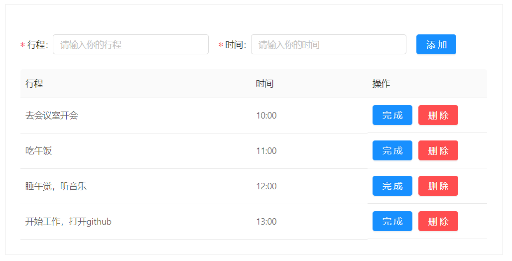

**react中的状态管理模式，react-redux的基本概念和使用方法....**

**react-redux 是一个专为 React 应用程序开发的状态管理模式。相对于redux，react-redux多了几个新的概念：**

1. connect([mapStateToProps], [mapDispatchToProps], [mergeProps], [options]):接收四个参数，它们分别是：
   
   1. `mapStateToProps`：mapStateToProps(state, ownProps)，这个函数允许我们将store中的数据作为props绑定到组件上
   2. `mapDispatchToProps`：它的功能是，将 `action` 作为 `props` 绑定到我们的组件上。
   3. `mergeProps`：不管是 stateProps 还是 dispatchProps ，都需要和 ownProps merge 之后才会被赋给 我们的组件 。 connect 的第三个参数就是用来做这件事。通常情况下，你可以不传这个参数， connect 就会使用 Object.assign 替代该方法。
   4. `options`：这个参数很少会用到，这里附上中文文档的定义:[文档地址](https://segmentfault.com/a/1190000017064759#item-2)
   
2. Provider：<Provider/>使得每一个被connect()函数包装过的嵌套组件都可以访问到Redux store。简单的来说，它就是react-redux提供的容器组件。

----

**示例：使用react-redux实现一个todoList**

**效果如下：**



**第一步：安装所需要的依赖：** 

1. `npm install redux react-redux --save-dev`
2. `npm install antd --save`
3. `npm install babel-plugin-import -S`

[antd配置按需加载](https://juejin.im/post/5c85dd51e51d453bfd3dc611)

**第二步：创建如下项目结构的文件和文件夹：**


**第三步：** 在src/actions/action-types.js目录下创建如下内容:(这里主要放置的是我们定义的action类型)

````js
//定义action-type
/*添加的action*/
export const ADD = "add";
/*删除的action*/ 
export const DEL = "del";
````
**第二步：** 在src/actions/action-operations.js 目录下创建如下内容:(这里放置的主要是我们对action-type响应的函数，我们可以通过调用这些方法，返回我们所需要的action对象。这些对象可以在组件中通过隐式调用dispatch方法，传递到我们的store中)

````js
import {ADD,DEL} from './action-types'

/*添加日程*/
export const addAction = msg =>{
    return {
        type:ADD,
        msg
    }
}

/*删除*/
export const delAction = id =>{
    return {
        type:DEL,
        id
    }
}
````

**第三步：** src/reducer/reducer.js 中输入以下内容：(这里就是我们的reducer函数，根据我们传入的action对象做出对应的处理。)

````js
/*引入action-types*/ 
import {ADD,DEL} from '../actions/action-types';
/*引入antd提示窗*/
import {message} from 'antd';

/*初始化值*/
const initState = {
    /*初始化列表内容*/
    list:[
        {key:0,id:0,title:"去会议室开会",time:"10:00"},
        {key:1,id:1,title:"吃午饭",time:"11:00"},
        {key:2,id:2,title:"睡午觉，听音乐",time:"12:00"},
        {key:3,id:3,title:"开始工作，打开github",time:"13:00"},
    ],
}

export default (state=initState,action)=>{
    let newState = JSON.parse(JSON.stringify(state));
    const type = action.type;
    switch (type) {
        /*如果action的类型是ADD，说明是添加。那么执行相应的添加逻辑*/
        case ADD:
            newState.list.push(action.msg)
            message.success("添加成功");
            return newState;
        /*如果action的类型是DEL，说明是删除，那么执行相应的是删除逻辑*/ 
        case DEL:
            newState.list.forEach((item,index)=>{
                if(item.id === action.id){
                    newState.list.splice(index,1)
                }
            })
            message.success("删除成功");
            return newState;
        default:
            /*其他情况下，默认返回*/
            return newState;
    }
}
````

**第四步：** 在src/store/index.js 中创建以下内容：(这里同redux一样，也是创建仓库并且把我们的reducer函数同仓库绑定起来)

````js
/*引入创建仓库*/
import {createStore} from 'redux';
/*引入reducer函数*/
import reducer from '../reducer/reducer';

/*创建仓库*/
const store = createStore(reducer);

/*导出仓库*/
export default store;
````

**第五步：** 在src/components/TodoList.jsx 目录下输入以下内容：(这一部分主要就是创建UI组件，在react-redux中我们通常都会常用这种方式：将一个react组件拆分成UI组件和容器组件。容器组件也就是我们处理逻辑和业务的组件，UI组件主要就是负责试图层的显示。)


````js
import React from 'react';
import { Form, Input, Button,Table,Card } from 'antd';
import "./todolist.css"

const TodoListUI= props =>{
    let {
        list,
        columns,
        flagId,
        getFieldDecorator,
        handleSubmit
    } = props;
    return (
        <Card style={{width:"800px",margin:"20px auto"}}>
            <div style={{margin:"20px",marginLeft:"0px"}}>
                <Form layout="inline" onSubmit={handleSubmit}>
                    <Form.Item label="行程">
                        {getFieldDecorator('title', {
                            rules: [{ required: true, message: '行程不能为空' }],
                        })(
                            <Input
                                style={{width:"250px"}}
                                placeholder="请输入你的行程"
                            />,
                        )}
                    </Form.Item>
                    <Form.Item label="时间">
                        {getFieldDecorator('time', {
                            rules: [{ required: true, message: '时间不能为空' }],
                        })(
                            <Input
                            style={{width:"250px"}}
                            placeholder="请输入你的时间"
                            />,
                        )}
                    </Form.Item>
                    <Form.Item>
                        <Button type="primary" htmlType="submit">
                            添加
                        </Button>
                    </Form.Item>
                </Form>
            </div>
            <Table 
                columns={columns} 
                dataSource={list} 
                size="middle" 
                pagination={false}
                rowClassName={item=> flagId.indexOf(item.id) !== -1 ? "table-style" : ""}
            />                

        </Card >
    )
}
export default TodoListUI
````

**第五步：** 在src/components/todolist.css 目录下输入以下内容：(这一部分，主要是创建样式。当我们点击完成按钮后，就改变对应行数据的样式)

````css
.table-style{
    text-decoration: line-through;
    color: #cccccc;
}
````

**第六步：** 在src/containers/TodoList.js 目录下输入以下内容：(这部分，主要是容器组件。容器组件就是沟通redux，然后帮助UI组件处理各种业务逻辑)

````js
import React, { Component } from 'react'
import { connect } from 'react-redux'
import TodoListUI from '../components/TodoList';
import {Button,Form} from 'antd';
/*引入action*/
import {addAction,delAction} from '../actions/action-operations';

export class TodoList extends Component {
    state={
        flagId:[] /*已经被的点击了完成的表格选择id值*/
    }
    /*点击完成按钮执行，将点击的id值存储到数据中*/
    complete(id){
        const {flagId} = this.state;
        flagId.push(id);
        this.setState({
            flagId
        })
    }
    /*点击添加执行的回调函数*/
    handleSubmit = e => {
        e.preventDefault();
        this.props.form.validateFields((err, values) => {
          if (!err) {
            const length = this.props.list.length;
            values.key = length;
            values.id = length;
            /*将表单获取到的数据，通过action的函数隐式调用dispatch。传递到store中*/
            this.props.addAction(values);
          }
        });
    };
    render() {
        let {
            list,
            delAction,
        }=this.props;
        const { getFieldDecorator } = this.props.form;
        const columns = [
            {
                title: '行程',
                dataIndex: 'title',
                width:400,
            },
            {
                title: '时间',
                dataIndex: 'time',
                width:200,
            },
            {
                title: '操作',
                width:200,
                render:(item)=>(
                    <div>
                        <Button onClick={()=>{this.complete(item.id)}} style={{marginRight:"10px"}} type="primary">完成</Button>
                        <Button onClick={()=>{delAction(item.id)}} type="danger">删除</Button>
                    </div>
                )
                
            }, 
        ];
        return (
            <div>
                <TodoListUI 
                    list={list}
                    columns={columns}
                    flagId={this.state.flagId}
                    getFieldDecorator={getFieldDecorator}
                    handleSubmit={this.handleSubmit}
                />
            </div>
        )
    }
}

/*将store管理的state，映射到组件的props上*/
const mapStateToProps = ({list}) => ({
    list,
})

/*将返回的action对象通过隐式调用dispatch传送到store中*/
const mapDispatchToProps = {
    addAction,
    delAction,
}
/*antd的表单组件连接*/
const TodoListForm = Form.create()(TodoList);
export default connect(mapStateToProps, mapDispatchToProps)(TodoListForm)
````

**第七步：** 在src/index.js 文件中输入以下内容：(在我们的入口js文件中，使用react-redux的Provider容器组件使每个被connect连接的容器组件都能访问到redux的store仓库)

````js
import React from 'react';
import ReactDOM from 'react-dom';
import TodoList from './contaniners/TodoList';
import {Provider} from 'react-redux';
import store from './store';

const App = (
    <Provider store={store}>
        <TodoList />
    </Provider>
)

ReactDOM.render(
    App, 
    document.getElementById('root')
);
````
**项目的源码我放置到了github的仓库中的`react-redux的学习`文件夹下** [源码地址](https://github.com/lmxyjy/redux_base)

**这里我们重点需要了解的两个api是：**

1. mapStateToProps
2. mapDispatchToProps

这里推荐一篇文章讲解这2个api的：[相关连接](https://www.tuicool.com/articles/MrmYN36)

----

**一个问题，当我们在项目开发中，肯定不能将所有的action处理都写到一个reducer函数中，因为这样会是我们的reducer文件过于臃肿，也不利于我们的后期维护。所以我们需要将多个reducer函数合并起来，在这里我们的redux也提供了相应的方法：**

`combineReducers`:可以将我们的多个reducer合并起来。

示例demo：

````js
/*reducer.js*/
import {combineReducers} from 'redux';
import adminReducer from './reducers/reducer-admin'; /*管理页面的reducer函数*/
import categoryReducer from './reducers/reducer-category';/*分类页面的reducer函数*/

let reducer = combineReducers({
    admin:adminReducer, /*合并后，在容器组件中调用的时候用key值做区分*/
    category:categoryReducer,
})
export default reducer
````
**这个api其实非常简单，但是我们在使用它的时候要注意我们在容器组件中调用的时候就不能直接写state了。应该写成以下的形式：**

````js
/*category的容器组件*/
const mapStateToProps = (state) => ({
    data:state.category.data,
    loading:state.category.loading
})

/*admin的容器组件*/
const mapStateToProps = (state) => ({
    time:state.admin.time
})
````
**可以看到，当我们默认一个reducer函数的时候，我们的state中存储的就是一个组件的值。但是当我们有多个reducer函数的时候，我们的值就会有很多了。我们在容器组件中调用的时候，就必须指定绑定的key值。这样才能确定拿到的是哪一个组件的状态值**

