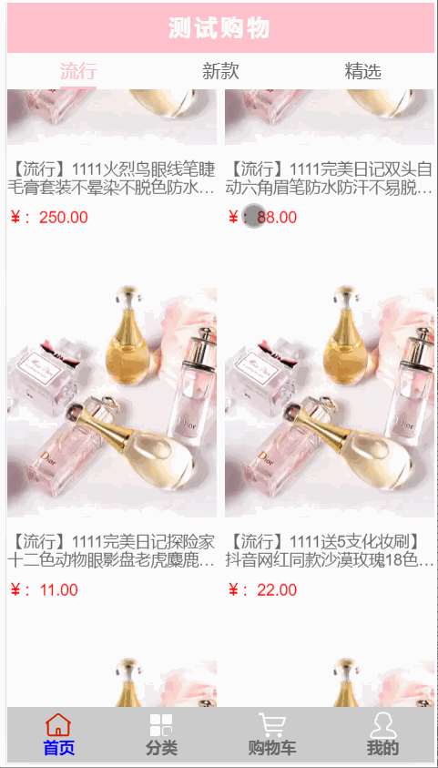
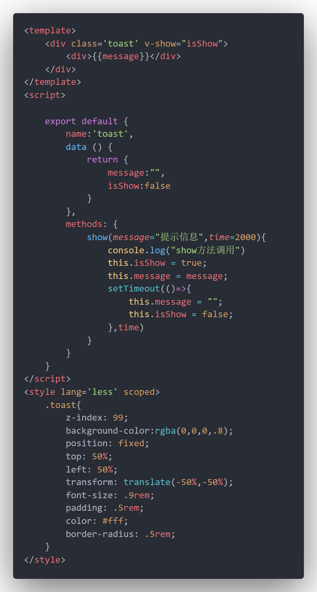

**记录在vue商城项目的开发中遇到的问题：**

**问题一、界面正常显示内容，但是控制台一直出现报错。**

**问题二、监听滚动后改变tab-title组件的样式为顶部固定，但是效果不生效。**

**问题三、记录状态值，当返回的时候能够停留到原来离开时的页面**

**问题四、better-scroll中使用异步加载的图片，不能够有效的计算实际的滚动高度**

**问题五、解决移动端点击300ms延迟的问题**

**问题六、全局提示组件的创建和使用**

**问题七、图片懒加载的实现**

**问题一、界面正常显示内容，但是控制台一直出现报错。**


**过程描述：**

1. 在开发过程中，我通过Home.vue组件的钩子函数create中发起数据请求。
2. 将请求到的数据交由vuex管理。
3. 在Home.vue将store中的数据传递到子组件GoodsList.vue中渲染。

**结果:**

界面能够正常显示，但是控制台报错：


**关键代码：**

Home.vue中请求数据的代码：


Home.vue中标签传值：


vuex的actions中发起异步请求的代码：


**原因：**

数据能够正常拿到，刚开始我以为是属性undefined的问题，就顺着这个思路一直查找，但是发现并没有什么用。后来我才发现报错信息中提示了_render的问题，于是在网上查了一下。发现可能是异步渲染导致问题，也就是说数据还没有请求完毕，但是页面已经渲染了，所以就出现了控制台报错的问题。

**解决方案：**

解决的方案就是，在传值的标签上加上判断：


**问题二、监听滚动后改变tab-title组件的样式为顶部固定，但是效果不生效。**

**过程描述：**

需求是要实现一个标题栏随着界面的滚动实现吸顶的效果，但是改变了样式后。并没有办法实现效果。

**原因：**

这是因为使用了`better-scroll`的原因，`better-scroll`通过操作`transform`改变滚动，这样导致了`position:fixed`的失效。

**解决方案：**

复制一份新的tab-title组件放置到scroll组件外，导航组件下。当滑动高度变化到临界值的时候。通过控制`v-show`实现两个标题栏的切换。



**问题三、记录状态值，当返回的时候能够停留到原来离开时的页面**

**过程描述：**

记录下老界面的浏览位置，当用户从其他页面切换回来的时候。保持之前的浏览位置。

**解决方案：**

这里我们使用到`keep-alive`这个标签保持组件不被销毁，然后使用`activated`和`deactivated`这两个钩子函数分别进行跳转和赋值操作。

`activated`:同`created`的执行周期一致，区别在于必须和keep-alive配合使用。而且每次进入到该组件的时候都会执行。
`deactivated`：与组件销毁之前的执行周期顺序一致，区别在于必须和keep-alive配合使用。而且每次离开该组件的时候都会执行。

**代码如下：**

1，在路由配置文件中，给需要保持生命的组件加上属性：

````js
...

{path:"/home",component:Home,meta:{keepAlive:true}},

...

````
2，在路由组件中，设置keep-alive包裹路由盒子，并且加上判断条件：

````html
...

    <keep-alive>
    <!--只要有keepAlive属性，那么就说明组件不用被卸载 -->
    <router-view v-if="$route.meta.keepAlive"/> 
    </keep-alive>
    <!-- 需要被卸载的组件放置在此 -->
    <router-view v-if="!$route.meta.keepAlive"/>

...

````

3，在不被卸载的组件中，加上钩子函数即可进行使用：

````js
...

    activated () {
        this.bscorll.y && this.bscorll.scrollTo(0,this.saveY); //跳转到离开时的位置
    },
    deactivated () {
        this.saveY = this.bscorll.y//保存离开时的位置
    },

...

````

**问题四、better-scroll中使用异步加载的图片，不能够有效的计算实际的滚动高度**

**过程描述：**

在使用better-scroll的过程中，当异步请求的图片渲染完成后。实际能拖动的高度并不是真实的盒子高度。

**原因：**

这是因为，better-scroll只会计算一次高度。而我们的图片是异步加载出来的，better-scroll计算高度的时候，可能图片还没有加载完毕。所以它得到的不是最终的高度，就会导致滚动高度不正确。

**解决方案：**

使用事件总线的方式：当图片加载完成(@load)后，发射事件(this.$bus.$emit("imgLoadFinish"))到外界，然后在首页中监听到这个事件执行后调用(refresh())方法。使better-scroll重新计算目前的高度。

**注意：** 为了避免图片过多，造成的多次刷新。可以使用函数防抖的方式去操作。

````js
    const refresh = debounce(this.bscorll.refresh,500);
    const finish = debounce(this.bscorll.finishPullUp,500);
    this.$bus.$on("imgLoadFinish",()=>{ //事件总线的方式取监听图片加载完成
        this.bscorll && refresh.apply(this.bscorll); //刷新scroll以重新计算高度
        finish.apply(this.bscorll)//图片渲染完成后上拉结束
    })
````

**问题五、解决移动端点击300ms延迟的问题**

可以使用fastClick库解决移动端浏览器默认点击事件延迟300ms的问题。

**使用方法如下:**

`npm install fastclick --save`

在main.js中:

````js
import fastClick from "fastclick";
fastClick.attach(document.body);//解决移动端300ms的延迟
````

**问题六、全局提示组件的创建和使用**

创建全局组件后，使用的时候只需要调用一个方法传参即可。非常的方便，创建的方式如下所示： 

组件代码：


index.js代码:
````js
import Toast from "./Toast"; //导入封装的组件
const obj = {}
obj.install = function(Vue){
    // 1，创建组件构造器
    const comConstructor = Vue.extend(Toast);
    //2，根据组件构造器创建一个组件对象
    const toast = new comConstructor();
    //3. 将组件对象手动挂载到某一个元素上面
    toast.$mount(document.createElement("div"));
    //4. 将元素添加到文档结构中,这个时候的toast.$el就是div了
    document.body.appendChild(toast.$el);
    //5. 将对象挂载到vue原型上面
    Vue.prototype.$toast = toast;
}
export default obj;
````
调用方法：
````js
this.$toast.show("提示信息2222",1000);
````

**问题七、图片懒加载的实现**

什么是图片懒加载？

图片需要出现在屏幕上的时候，再加载这张图片。

在vue中想要实现图片懒加载，可以使用vue的库。vue-lazyload。

`npm install vue-lazyload --save`

使用方法：

在main.js中:

````js
import VueLazy from "vue-lazyload";

Vue.use(VueLazy,{
  loading:require("./assets/img/home/recommend_bg.jpg") //占位图
}); //图片懒加载插件
````

使用的时候，在需要使用图片懒加载的img标签中:

````html

````
